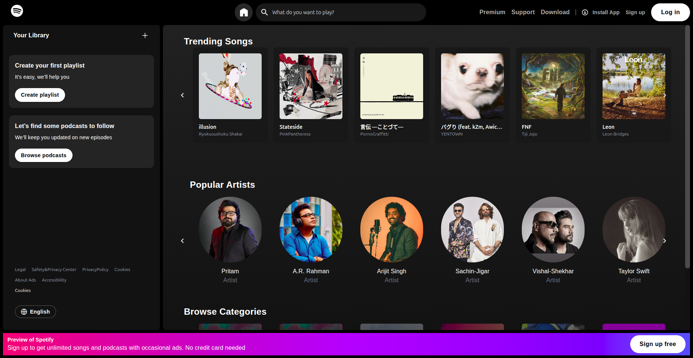

# Spotify Clone

A responsive, modern Spotify-like web application built with **React**, **TypeScript**, **Tailwind CSS**, **Material UI**, and **Spotify Web API**. It replicates the core functionality and layout of the Spotify homepage, allowing users to view trending albums, popular artists, user playlists, and recently played tracks.

---

## Features

- **Authentication via Spotify OAuth**
- **Fetch and display user's Recently Played tracks**
- **User Playlists** with dynamic rendering
- **Top Artists** and **Top Tracks**
- **Trending Albums** with lazy loading scroll
- Fully responsive UI with Material UI and Tailwind CSS
- Reusable carousel components using Tailwind CSS

---

## Tech Stack

| Frontend        | Description                            |
|-----------------|----------------------------------------|
| React           | JavaScript library for building UI     |
| TypeScript      | Typed superset of JavaScript           |
| Tailwind CSS    | Utility-first CSS framework            |
| Material UI     | React component library for UI         |

| API             | Description                            |
|-----------------|----------------------------------------|
| Spotify Web API | Used to fetch user data and music info |

---

## Screenshots


---

## Installation & Setup

```bash
# 1. Clone the repo
git clone https://github.com/yourusername/spotify-clone.git
cd spotify-clone

# 2. Install dependencies
npm install

